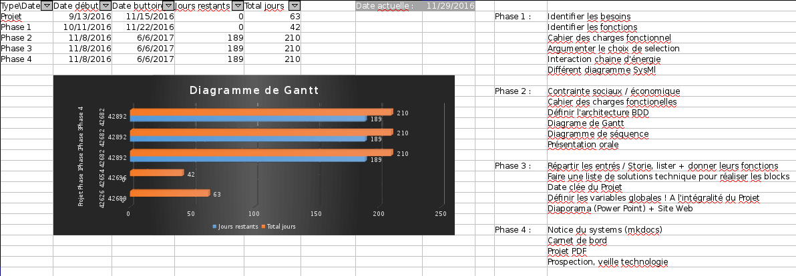
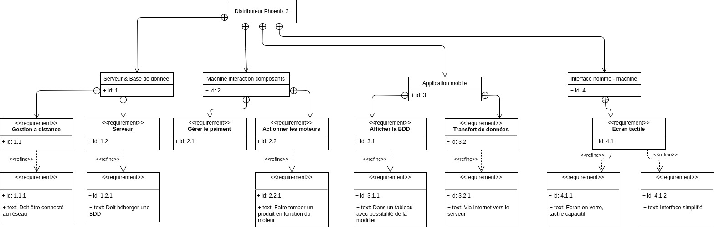
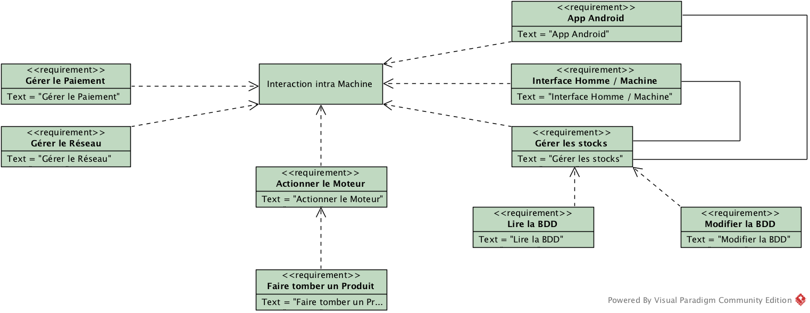
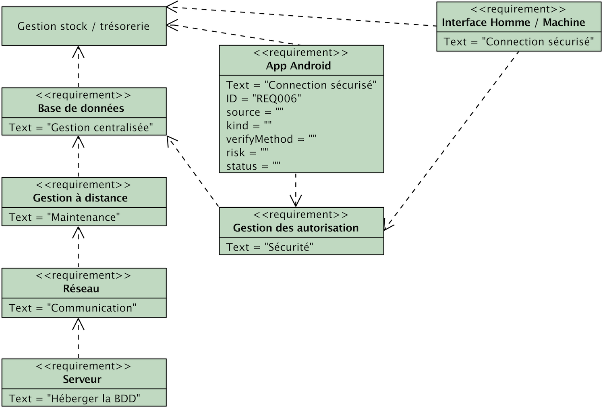
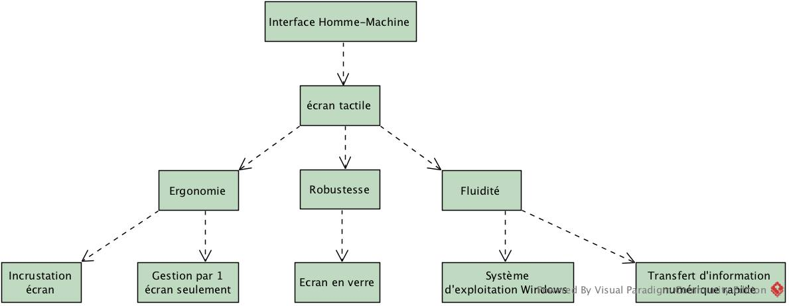
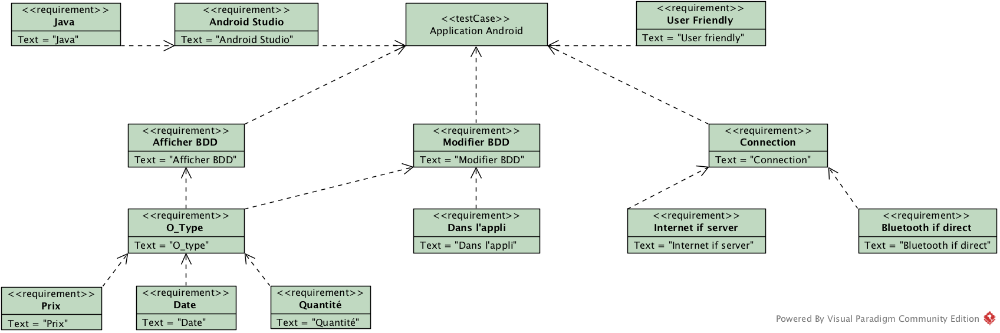
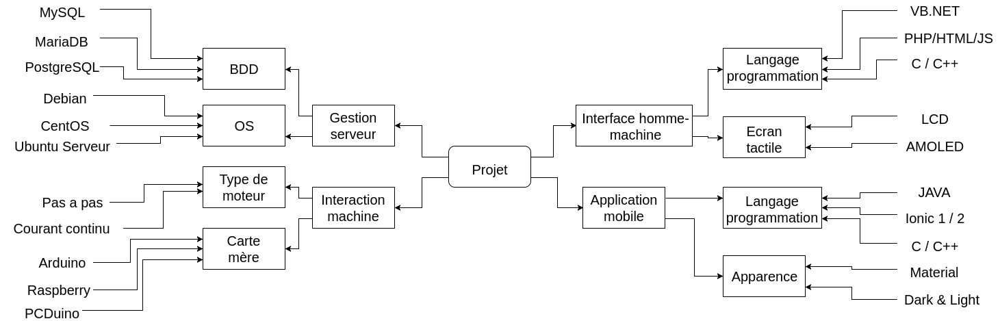
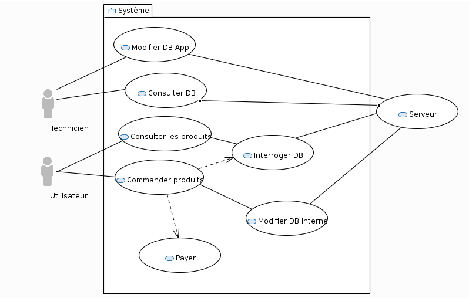

# Phoenix3
### **Presentation:**
Notre projet porte sur un distributeur automatique de nourriture, la différence  qu'il a avec un distributeur quelquonque,  est qu'il est géré par une application smartphone de maintenance qui communique à l'agent les dates de péremption des produit ainsi que la quantité actuel des produit de la machine.
Notre machine se veut actuelle avec une interface homme-machine tactile et intuitive  avec une prise en main facile.
Les données de la machine seront envoyés sur une carte de traitement interne à la machine puis ces données seront retransmis à un serveur et enfin à l'application, quand un produit commence à manquer ou qu'un produit atteint sa date de péremption.

### **Details de chaques parties:**
- *Application Android:* Nous allons coder l'application android à l'aide des languages HTML/JS/CSS ; puis la compiler en un apk (grâce à Android-SDK, Ionic et Cordova) qui est le format natif des application sur des smartphone android.
- *Interface Homme-Machine:* Nous avons choisi un écran tactile pour l'interface homme-machine pour la facilitée et la modernitée de cette technologie, qui est facile à prendre en main, nous allons coder sur la motherboard en arduino sous le système windows. L'interface sera faite avec Visual Basic qui est un language facile à apprendre.
- *Interaction Machine:* Nous allons travailler sur une interaction entre le serveur et des moteurs pas à pas, grâce à un module arduino intégré à la motherboard, nous avons choisi une alimentation 5V 2A qui est adapter à l'alimentation usb.
- *Interaction Serveur:* Nous avons choisi d’utiliser le système de base de données MySQL pour la gestion des stocks et de la trésorerie de la machine. L’application Android et l’interface homme-machine se connecteront et utiliserons cette base de données.

### Besoin: 
**Pourquoi avoir besoin de notre module de distributeur ?**
- Pour mieux exploiter son distributeur en auto-gestion
- Eviter les pertes de consommables
- Un contrôle d'un simple coup d'oeil sur son smartphone (*et pas au volant !*)
- Le tout en restant à moindre coût ! 

### Fonction:
**Mais que donc sera capable de faire notre module ?**
- Il sera capable de modifier une base de données en fonction des produits restants
- Avertissement lors de manque de stock, d'approche de péremption de produits
- Modifier les prix à tout moment depuis une application android (et depuis une interface web *optionnel*)

### **Ou nous en sommes:**
- [ ] **Diagramme Gantt**
- [ ] **Diagrammes SysML**
	- [x] Diagramme Exigences
	- [ ] Diagramme Définition de Blocks
	- [ ] Diagramme de Blocks Interne
	- [x] Diagramme de cas d'utilisation
	- [ ] Diagramme de séquence
	- [ ] Diagramme d'état
- [x] **Carte mentale du projet**
- [ ] **Revue de Projet 1**
- [ ] **Revue de Projet 2**
- [ ] **Prototypes**
- [ ] __*Projet fini*__

## Sommaire
1. [Logbook](#logbook)
	* [Avant projet](#avant-projet)

<!-- * [Partie 1 avant 1er revue](#partie1)
	* [Partie 2 après 1er revue](#partie2) -->
2. [Différents diagrammes](#diagrammes)
	* [Gantt][gant]
	* [Exigences][exi]
		* [Maxime][emax]
		* [Louis][elouis]
		* [Anthony][eantho]
		* [Johan][ejohan]
	* [Carte mentale][cm]
	* [Cas utilisation][cu]
	
<!-- 3. [Documentation]()
4. [Contact](#contact)
5. [Credits](#credits) -->

---

# Logbook
## Avant projet
- [15/11/2016] - Organisation du projet, fait le gros du diagramme de [Gantt][gant] (il reste à découper les parties/taches), le diagramme [d'exigences][exi] et listé les différentes taches à faire.

- [22/11/2016] - Ajout de la partie de Louis au diagramme des [exigences][exi], ajout des différents diagrammes d'exigences. Fin de la carte mentale du projet par Anthony, ajout en ligne, définition du besoin et de la fonction par johan.

<!-- ## Partie 1 -->

<!-- ## Partie 2 -->

---

# Diagrammes
## Gantt

## Exigences

### Exigences Maxime

### Exigences Louis

### Exigences Anthony

### Exigences Johan

## Carte mentale

## Cas utilisation

[gant]: #gantt
[exi]: #exigences
[emax]: #exigences-maxime
[elouis]: #exigences-louis
[eantho]: #exigences-anthony
[ejohan]: #exigences-johan
[state]: #etat
[seq]: #sequence
[BDD]: #definition-de-blocs
[IBD]: #blocs-internes
[cm]: #carte-mentale
[cu]: #cas-utilisation