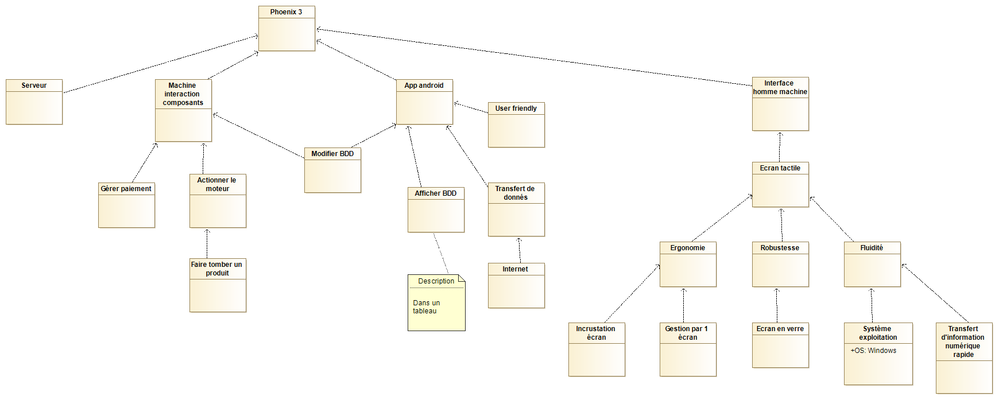

# Phoenix3
### **Presentation:**
Notre projet porte sur un distributeur automatique de nourriture, la différence  qu'il a avec un distributeur quelquonque,  est qu'il est géré par une application smartphone de maintenance qui communique à l'agent les dates de péremption des produit ainsi que la quantité actuel des produit de la machine.
Notre machine se veut actuelle avec une interface homme-machine tactile et intuitive  avec une prise en main facile.
Les données de la machine seront envoyés sur une carte de traitement interne à la machine puis ces données seront retransmis à un serveur et enfin à l'application, quand un produit commence à manquer ou qu'un produit atteint sa date de péremption.

### **Details de chaques parties:**
- *Application Android:* Nous allons coder l'application android à l'aide des languages HTML/JS/CSS ; puis la compiler en un apk (grâce à Android-Studio, Ionic et Cordova) qui est le format natif des application sur des smartphone android.
- *Interface Homme-Machine:* Nous avons choisi un écran tactile pour l'interface homme-machine pour la facilitée et la modernitée de cette technologie, qui est facile à prendre en main, nous allons coder sur la motherboard en arduino sous le système windows. L'interface sera faite avec Visual Basic qui est un language facile à apprendre.
- *Interaction Machine:* Nous allons travailler sur une interaction entre le serveur et des moteurs pas à pas, grâce à un module arduino intégré à la motherboard, nous avons choisi une alimentation 5V 2A qui est adapter à l'alimentation usb.
- *Interaction Serveur:*

### **Ou nous en sommes:**
- [x] Diagramme Gantt
- [ ] Diagrammes SysML
- [ ] Revue de Projet 1
- [ ] Revue de Projet 2
- [ ] Prototypes
- [ ] *Projet fini*

## Sommaire
1. [Logbook](#logbook)
	* [Avant projet](#avant-projet)

<!-- * [Partie 1 avant 1er revue](#partie1)
	* [Partie 2 après 1er revue](#partie2) -->
2. [Différents diagrammes](#diagrammes)
	* [Gantt][gant]
	
<!-- 3. [Documentation]()
4. [Contact](#contact)
5. [Credits](#credits) -->

---

# Logbook
## Avant projet
- [15/11/2016] - Organisation du projet, fait le diagramme de [Gantt][gant], le diagramme d'exigences et listé les différentes taches à faire.

<!-- ## Partie1 -->

<!-- ## Partie2 -->

---

# Diagrammes
## Gantt

## Exigences

[gant]: #gantt
[exi]: #exigences
[state]: #etat
[seq]: #sequence
[BDD]: #definition-de-blocs
[IBD]: #blocs-internes