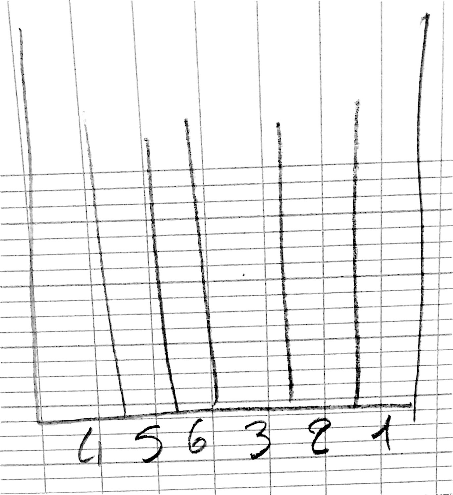
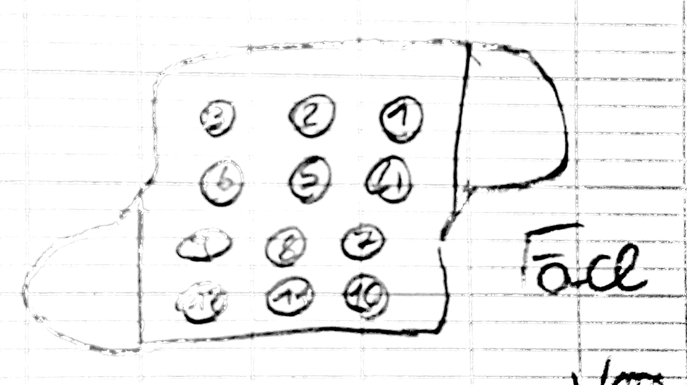
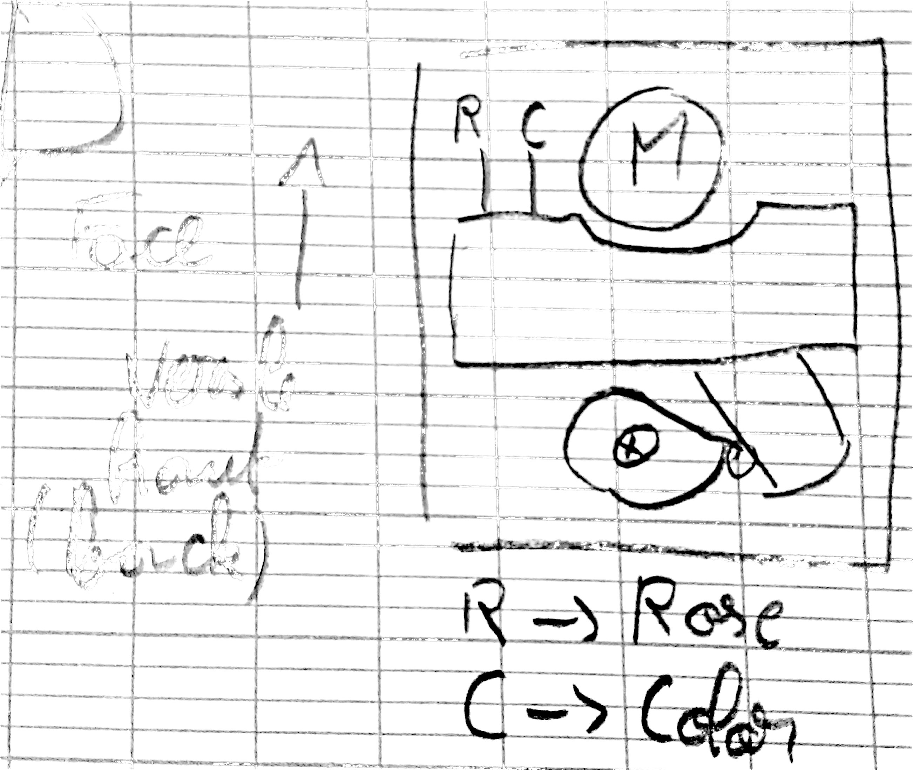
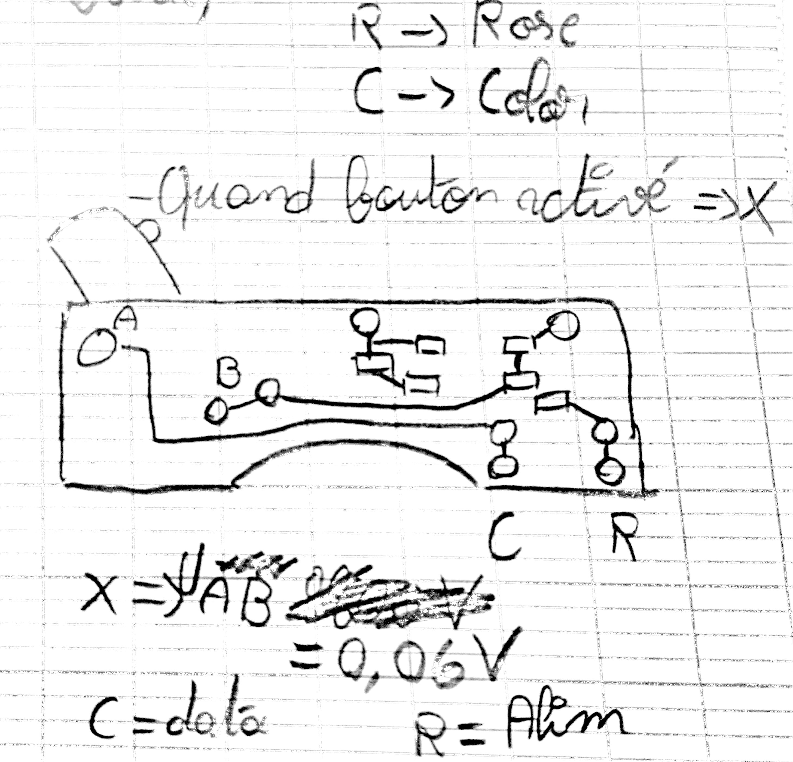

# Documentation du rack

## Liste des fils et position sur la prise

1. Fil: orange
2. Fil: bleu clair
3. Fil: blanc
4. Fil: gris
5. Fil: jaune
6. Fil: bleu foncé
7. Fil: rose
8. Fil: noir
9. Fil: marron
10. Fil: **none**
11. Fil: **none**
12. Fil: **none**

## Vue de haut du rack

## Vue de la prise du rack

## Présentation du bloc moteur

### Arrière

### Carte électrique

